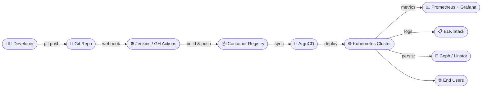

<div align="center">

```
╔══════════════════════════════════════════════════════════════╗
║  ██████╗ ███████╗██╗   ██╗ ██████╗ ██████╗ ███████╗        ║
║  ██╔══██╗██╔════╝██║   ██║██╔═══██╗██╔══██╗██╔════╝        ║
║  ██║  ██║█████╗  ██║   ██║██║   ██║██████╔╝███████╗        ║
║  ██║  ██║██╔══╝  ╚██╗ ██╔╝██║   ██║██╔═══╝ ╚════██║        ║
║  ██████╔╝███████╗ ╚████╔╝ ╚██████╔╝██║     ███████║        ║
║  ╚═════╝ ╚══════╝  ╚═══╝   ╚═════╝ ╚═╝     ╚══════╝        ║
╚══════════════════════════════════════════════════════════════╝
```

# `> Satyajit Barik`


<br/>

[](https://github.com/satyajitbarik)

[](https://linkedin.com)

</div>

---

<div align="center">

## ⚡ `whoami`

</div>

```yaml
name: Satyajit Barik
role: Senior DevOps Engineer
location: India 🇮🇳
experience: "3+ years production-grade infrastructure"

focus:
  - Kubernetes cluster engineering (kubeadm)
  - Cloud migrations & workload portability
  - Infrastructure as Code (Terraform)
  - CI/CD automation & GitOps
  - Storage engineering (Ceph · Linstor · DRBD)

currently:
  building: "Production K8s clusters on Utho Cloud"
  migrating: "Azure → Utho Cloud workloads"
  automating: "Everything that can be automated"

philosophy: "Reliability is a feature. Automation is the product."
```

---

## 🗂 Featured Projects

<table>
<tr>
<td width="50%">

### ☸️ K8s Cloud Migration
**Azure → Utho Cloud**

Production Kubernetes workload migration with zero-downtime cutover, optimized storage via Linstor, and GitOps-driven deployment pipeline.

`Kubernetes` `Linstor` `Jenkins` `Terraform`

</td>
<td width="50%">

### 🏗 Terraform Modular IaC
**Multi-Cloud Infrastructure**

Reusable, versioned Terraform modules for provisioning VPCs, subnets, security groups, and managed services across Azure, AWS, and Utho Cloud.

`Terraform` `Azure` `AWS` `GitOps`

</td>
</tr>
<tr>
<td width="50%">

### 📦 Object Storage Platform
**S3-Compatible at Scale**

Self-hosted S3-compatible object storage layer integrated with Kubernetes workloads, handling production traffic with high durability.

`Ceph` `S3` `Kubernetes` `Linux`

</td>
<td width="50%">

### 🔁 Full CI/CD GitOps Pipeline
**End-to-End Automation**

Jenkins → Container Registry → ArgoCD deployment pipeline with automated rollbacks, health checks, and Slack alerting.

`Jenkins` `ArgoCD` `GitHub Actions` `Helm`

</td>
</tr>
</table>

---

## 🛠 Tech Stack

<div align="center">

### Cloud & Orchestration


### Infrastructure as Code


### CI/CD


### Observability


### Storage & Databases


### Security


### Scripting


</div>

---

## 📊 GitHub Stats

<div align="center">


<br/>

[](https://git.io/streak-stats)

</div>

---

## 🏛 Core Competencies

```
╭─────────────────────────────────────────────────────────────╮
│  INFRASTRUCTURE          PLATFORM                           │
│  ├─ Kubernetes (kubeadm) ├─ CI/CD (Jenkins, ArgoCD)        │
│  ├─ Terraform IaC        ├─ GitOps workflows                │
│  ├─ Cloud Migration      ├─ Container registries            │
│  └─ HA System Design     └─ Secrets management (Vault)     │
│                                                              │
│  STORAGE                 RELIABILITY                        │
│  ├─ Ceph / RBD           ├─ Prometheus + Grafana            │
│  ├─ DRBD / Linstor       ├─ ELK Stack                      │
│  ├─ S3-compatible        ├─ On-call & RCA                   │
│  └─ ZFS / LVM            └─ SLI/SLO implementation         │
│                                                              │
│  NETWORKING              SECURITY                           │
│  ├─ VPC / Subnet design  ├─ RBAC & least privilege          │
│  ├─ Load balancers       ├─ SSL/TLS management              │
│  ├─ DNS management       ├─ Network security groups         │
│  └─ Firewall / NSG       └─ OAuth / Zero-trust concepts     │
╰─────────────────────────────────────────────────────────────╯
```

---

## 🗺 Architecture Snapshot



---

<div align="center">

### `> Let's build something reliable.`

[](mailto:bariksatyajit04@gmail.com)
[](https://linkedin.com)
[](https://github.com/Satya2234)

<br/>

*"Automate the boring. Architect for failure. Ship with confidence."*


</div>
